<h1>Watch<a href="https://youtu.be/ZhPfEGRZJ98"> Vidoe </a>before, please</h1>

<h2>Student Web Platform</h2>
I have used another platform (<a href="https://www.000webhost.com">000webhost</a>) to deploy my project (because I have used php) Github and Heroku don't work with PHP, so this is why repository has been created today 
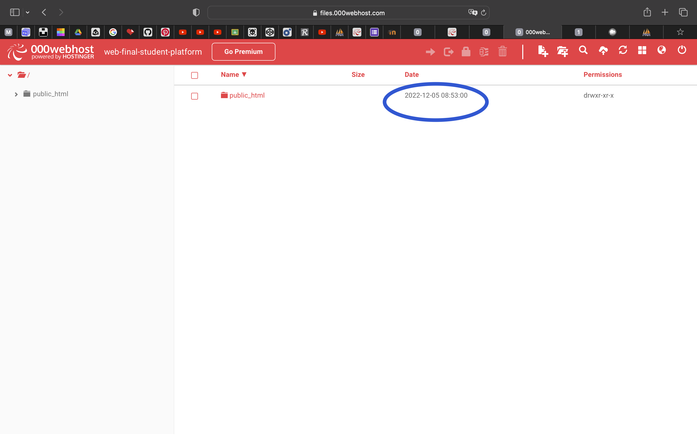

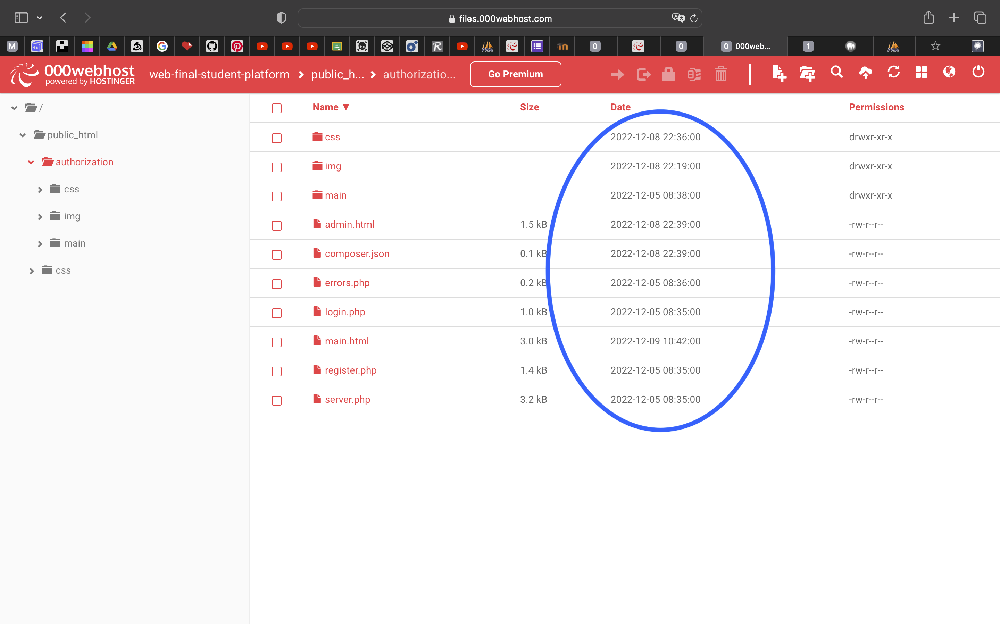

detailed information <a href="https://youtu.be/ZhPfEGRZJ98">video</a>

1) First page has log in and register button.
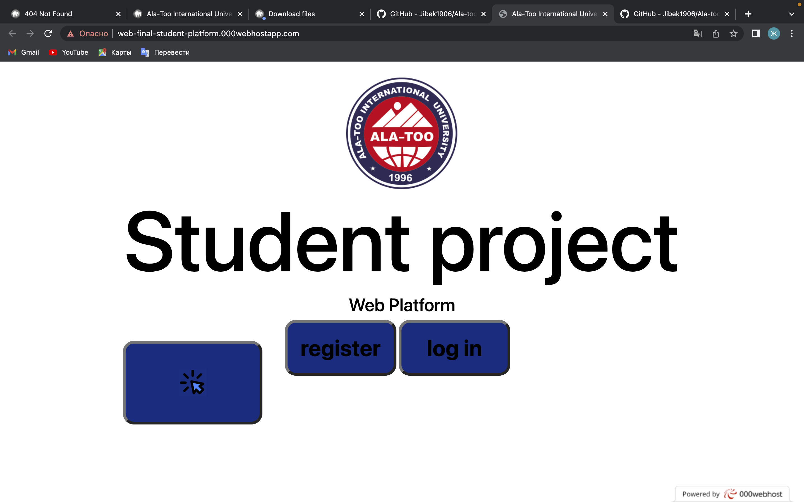 Also you can see another big button it's use <strong> Fetch Api </strong>(give you random pictures) just for points :)
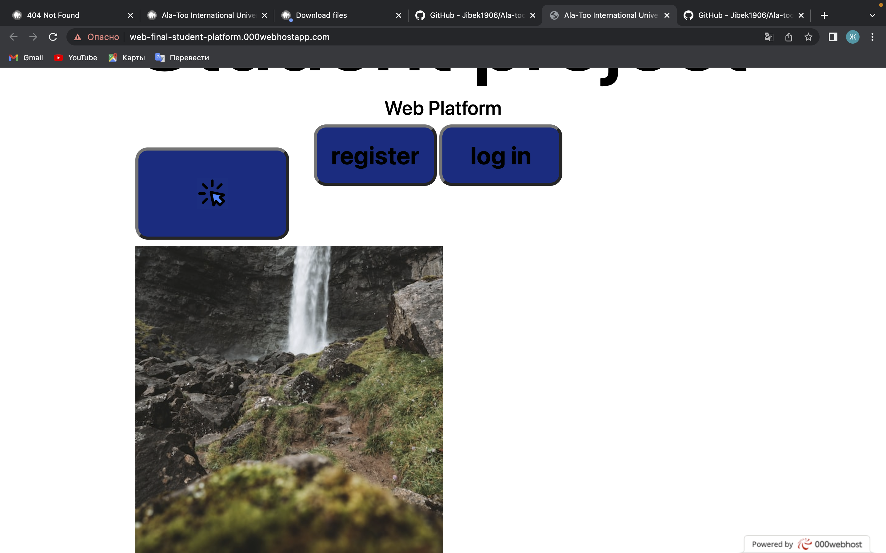
if you click on register.
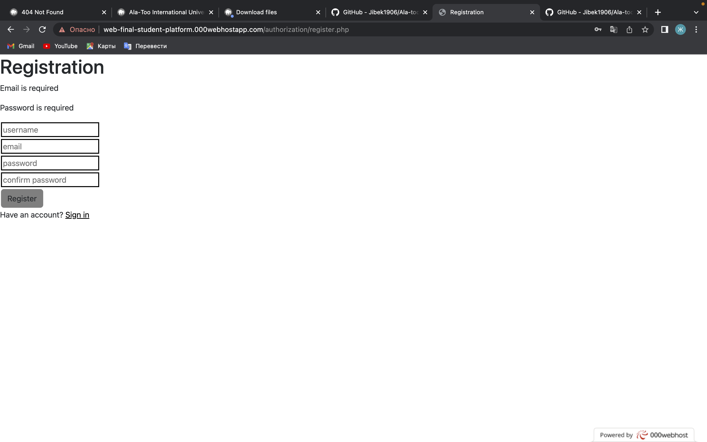
It will open new page where you can register (it's connected with database).
After go to log in and write your email and password.
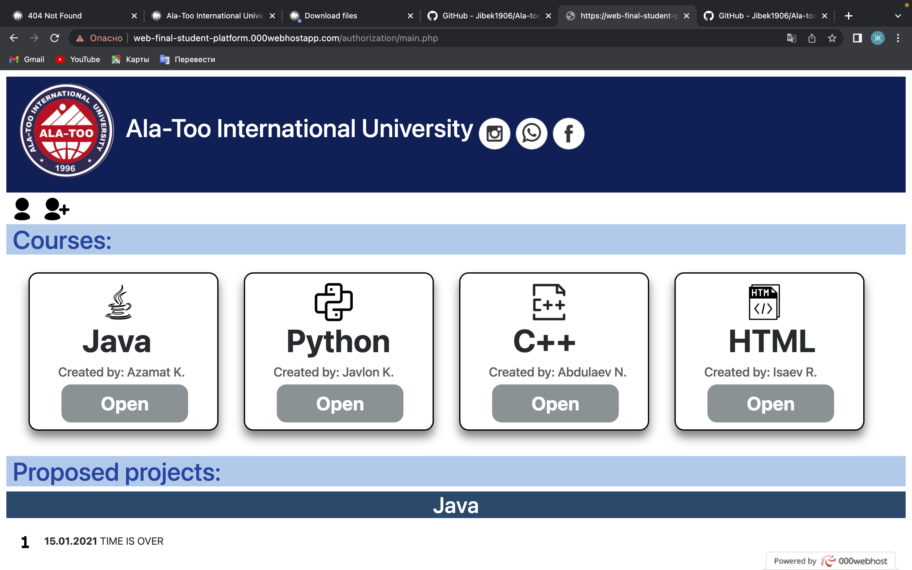
1) A the top you can see icons 
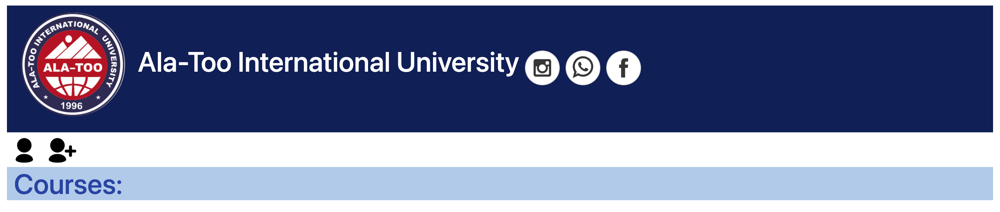 by clicking on them you can find Ala-Too University social networks.
1) Under it you can see icons,
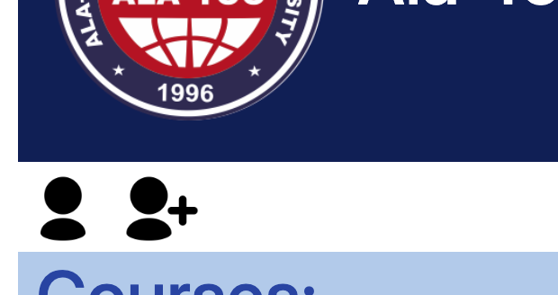
 if you click on them you cab go to log in and register.
1) And main part courses.
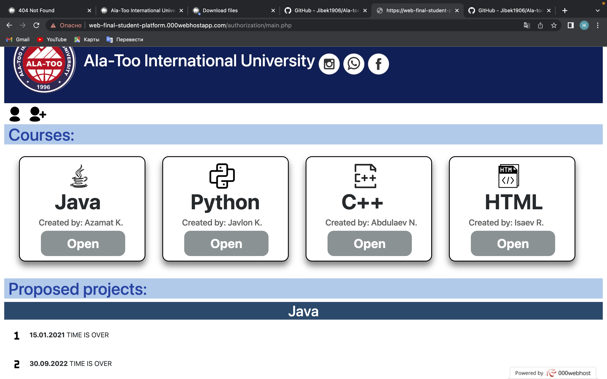
Click on them 
<srtong>Courses</strong>
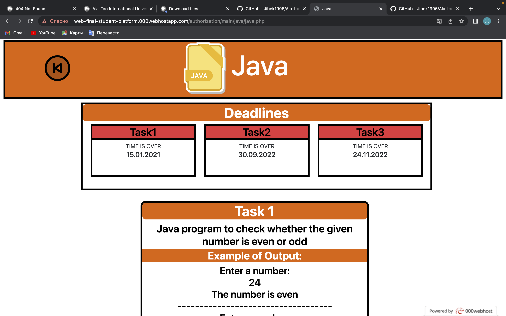
All courses have same structure (Deadlines, 3 tasks and downloads buttons)
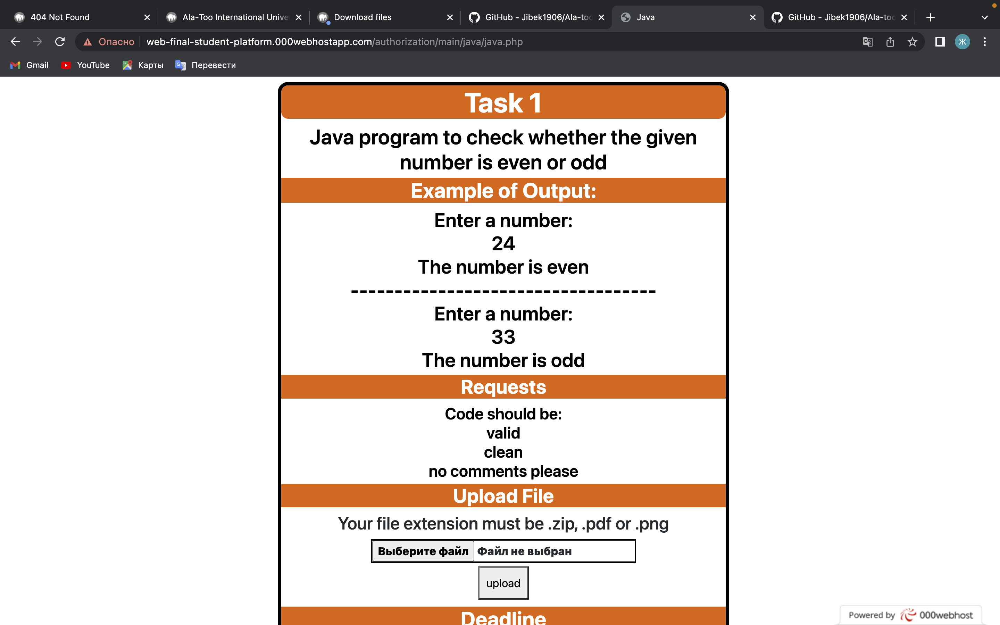
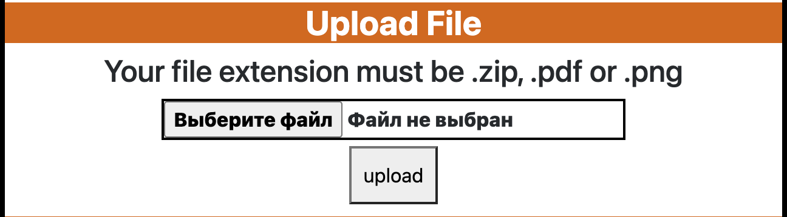
On the top you also can see icon which will get you back to main.php
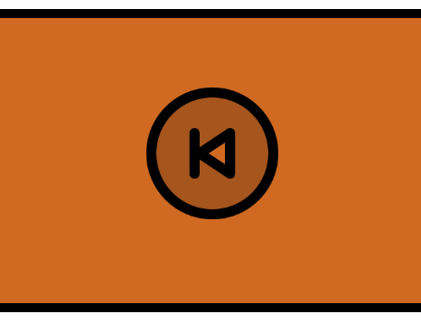
1) And last part on the page Proposed Projects.
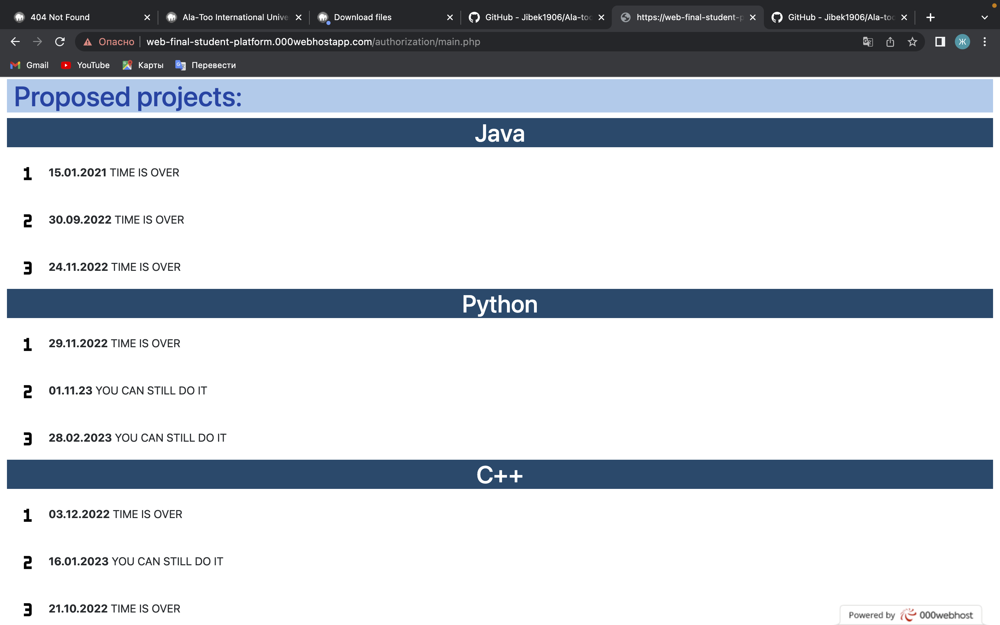 
Here I placed or dates you can see if you have time to do task or not

