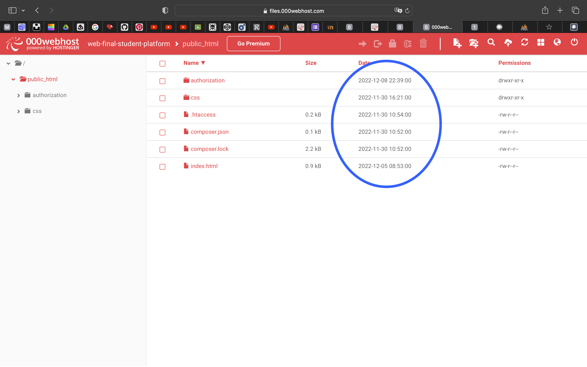

<h1>Student Web Platform</h1>
I have used another platform (<a href="https://www.000webhost.com">000webhost</a>) to deploy my project (because I have used php) Github and Heroku don't work with PHP, so this is why repository has been created today 

